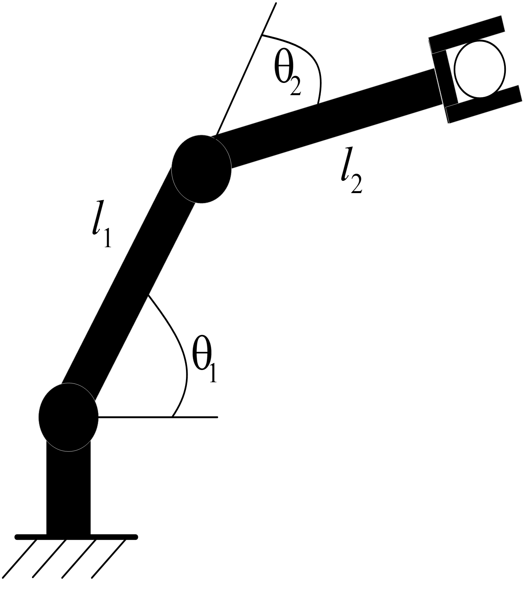
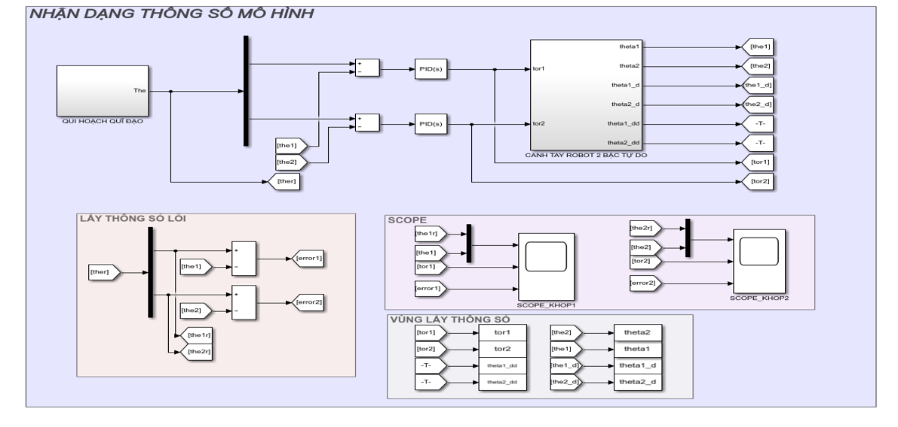
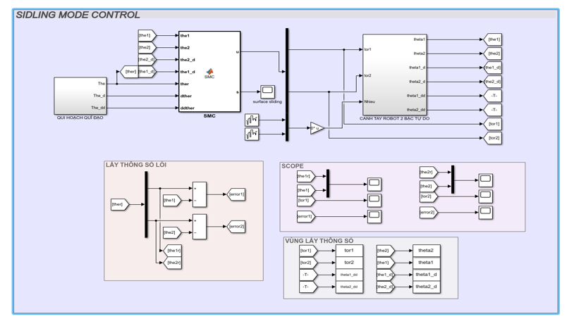
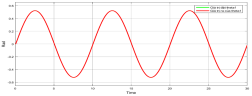
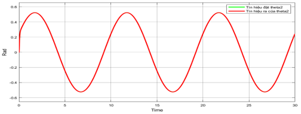

 <h1 align="center">System Identification and Control</h1>

# Introduction
This project implements the modeling of a 2-degree-of-freedom robotic arm system. Then proceed to identify the model parameters by the method of least squares and apply the sliding controller to the 2-degree-of-freedom robotic arm system.

# Modeling of a 2-DOF robotic arm 
2-DOF robot model is given as shown below:

   
  <i>Robot 2-DOF</i>

The parameters of 2-DOF robot are presented in this file **Final_project.pptx**.

# Model parameter identification by the method of least squares (LS)
In fact, a robot to determine the parameters of the robot, using measuring tools to determine, we only determine the length and mass of each robot stage. So in this 2-DOF robot system, the group identifies 4 parameters as the moment of inertia of the two joints, and the position of the center of gravity of the two joints, which is difficult to determine with conventional measuring tools.

   
  <i>Simulink identifies parameters of a robot model with 2-DOF</i>

The table below shows to compare the robot's initial parameter results and after identification:

| Parameters Robot 2-DOF           | #Izz1 | #Izz2 | #lc1|  #lc2| 
|----------------------------------|:----------:|:-------------:|:--------------:|:--------------:|
| Initial parameters               |    0.05    |      0.05     |      0.4       |      0.4       |
| Parameters after identification  |    0.0491  |      0.0509   |      0.4009    |      0.3989    |

# Applying sliding mode control (SMC) to the 2-DOF robotic arm system
Sliding control (SMC) is a nonlinear control method that modifies the dynamics of a nonlinear system by applying a discontinuous control signal to control the sliding system along a designed sliding surface.
The design steps of a sliding controller for a two-degree-of-freedom robotic arm system are as follows:
* **Step 1**: Set up the equation of state from the dynamics equation
* **Step 2**: Select the slide surface for the controller
* **Step 3**: Write the expression for the linear tracking controller. Calculating the parameters of the tracking controller
* **Step 4**: Design the filter for the system

   
  <i>Simulink simulation of the SMC for a 2-DOF robotic arm</i>

# Simulation results
Output and input signals of the two joints when there is no noise affecting the system:

  
  

Output and input signals of the two joints when there is noise affecting the system:

  
  

# Video Modeling, identifying and designing a sliding mode control for a 2-DOF manipulator 
https://youtu.be/Poq2k56A2nY

